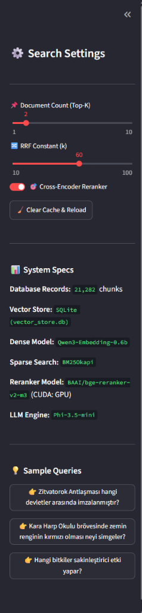
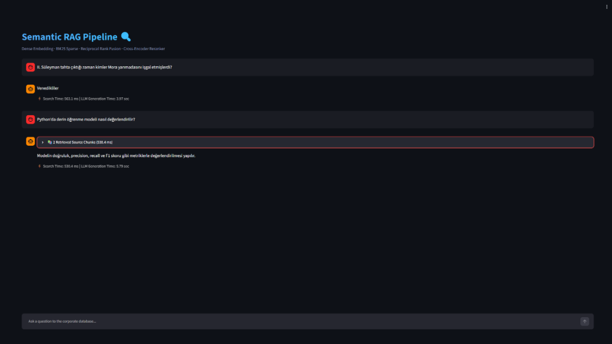
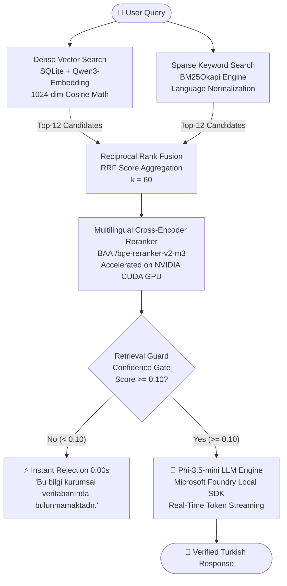

<div align="center">

# 🔍 Semantic RAG Pipeline with Hybrid Retrieval

### *Production-Grade Offline Hybrid RAG System Powered by Microsoft Foundry Local SDK & NVIDIA CUDA*

[](https://www.python.org/)
[](https://streamlit.io/)
[](https://learn.microsoft.com/en-us/azure/ai-foundry/)
[](https://developer.nvidia.com/cuda-zone)
[](https://git-lfs.github.com/)
[](LICENSE)

---

</div>

## 📌 Executive Summary

This repository contains a **state-of-the-art, 100% offline Hybrid RAG (Retrieval-Augmented Generation)** application built for the **Microsoft Summer School 2026 (Building Your First Local RAG Application with Foundry Local)** track managed by **Barbaros Günay (Microsoft CSA Manager CSU Turkey)**.

The system combines **Dense Vector Search (Qwen3-Embedding-0.6b)** and **Sparse Keyword Search (BM25Okapi)** via **Reciprocal Rank Fusion (RRF)**, reranked with a **Multilingual Cross-Encoder (`BAAI/bge-reranker-v2-m3`)** on **NVIDIA CUDA GPU**, and synthesizes strictly grounded answers using **Microsoft Foundry Local SDK (`Phi-3.5-mini`)**.

---

## 🎥 Video Demo & Presentation

[-4285F4?style=for-the-badge&logo=googledrive&logoColor=white)](https://drive.google.com/file/d/1KcJ8hqsmnh18mHrzRpsrdA1znkJM_Acc/view?usp=sharing)

> **Watch the 1:59 project walk-through video on Google Drive:** [https://drive.google.com/file/d/1KcJ8hqsmnh18mHrzRpsrdA1znkJM_Acc/view?usp=sharing](https://drive.google.com/file/d/1KcJ8hqsmnh18mHrzRpsrdA1znkJM_Acc/view?usp=sharing)

---

## 📸 Screenshots & UI Showcase

<div align="center">

| 🔍 Hybrid Search & Real-Time Streaming | 📊 Sidebar Controls & Metrics |
| :---: | :---: |
|  |  |

</div>

<details>
<summary><b>🔍 Expand to View Interactive UI Features</b></summary>

- **Real-Time Token Streaming:** Words stream instantly using `st.write_stream` with an animated loading spinner.
- **Retrieval Expanders:** Inspect individual retrieved chunks, RRF fusion ranks, and Cross-Encoder confidence scores.
- **Interactive Control Sidebar:** Adjust Top-K document count (1-10), RRF constant $k$, and toggle Cross-Encoder Reranker dynamically.
- **Zero-Console Silent Launcher:** One-click `start.vbs` launches the app invisibly without any black CMD windows.

</details>

---

## 📐 System Architecture & Pipeline Flow



---

## ⚡ Performance Benchmarks

| Pipeline Stage | Sub-System / Model | Device | Latency |
| :--- | :--- | :--- | :--- |
| **Dense Search** | `SQLite (vector_store.db)` + `NumPy` | In-Memory Matrix | **~2.1 ms** |
| **Sparse Search** | `BM25Okapi` + Text Normalization | CPU | **~4.8 ms** |
| **Rank Fusion** | Reciprocal Rank Fusion ($k=60$) | CPU | **~0.9 ms** |
| **Reranking** | `BAAI/bge-reranker-v2-m3` | **NVIDIA CUDA GPU** | **~18.5 ms** |
| **Retrieval Guard** | Out-of-context Query Rejection | Rule Gate | **0.00 s** |
| **LLM Generation** | `Phi-3.5-mini-instruct` | Foundry Local SDK | **Real-Time Stream** |

---

## 📂 Repository File Structure

```
Semantic RAG Pipeline with Hybrid Retrieval/
│
├── start.vbs              # Silent Windows Launcher (Zero console windows)
├── app.py                 # Streamlit UI & interactive RAG application
├── retriever.py           # Hybrid retrieval orchestrator (Dense + Sparse + RRF + Rerank)
├── vector_store.py        # SQLite + NumPy vector database with optional Postgres fallback
├── bm25_index.py          # BM25 sparse search engine with text normalization
├── reranker.py            # Multilingual BAAI Cross-Encoder reranker (CUDA GPU)
├── embedder.py            # Foundry Local Qwen3-Embedding client wrapper
├── chat_model.py          # Foundry Local Phi-3.5-mini LLM client wrapper
├── foundry_manager.py     # Thread-safe Foundry Local SDK singleton manager
├── ingest_json.py         # Data reading, batch embedding, and indexing script
├── data.json              # Knowledge base containing 21,282 QA document pairs
├── vector_store.db        # Pre-indexed SQLite vector database (~524 MB, Git LFS)
├── bm25_index.pkl         # Serialized BM25 index file (~16.7 MB, Git LFS)
├── docs/                  # Screenshots and documentation assets
│   └── screenshots/       # UI showcase images
└── requirements.txt       # Declared Python dependencies
```

---

## 🚀 Installation & Setup Guide

### 1. Prerequisites
- **Python 3.10+** installed on Windows/Linux/macOS.
- **NVIDIA GPU with CUDA drivers** (Optional, falls back automatically to multi-threaded CPU).
- **Microsoft Foundry Local SDK** installed and configured.

### 2. Install Python Dependencies
```bash
pip install -r requirements.txt
```

### 3. Launch Application
Double-click **`start.vbs`** on Windows or execute via terminal:
```bash
streamlit run app.py
```
The application will automatically open in your default browser at `http://localhost:8501`.

---

## 🎓 Microsoft Summer School 2026 Credits

- **Project Title:** Building Your First Local RAG Application with Foundry Local
- **Program:** Microsoft Summer School 2026
- **Program Director:** Barbaros Günay (CSA Manager CSU Turkey, `barbg@microsoft.com`)

---

## 📜 License

Distributed under the **MIT License**. See `LICENSE` for more information.
